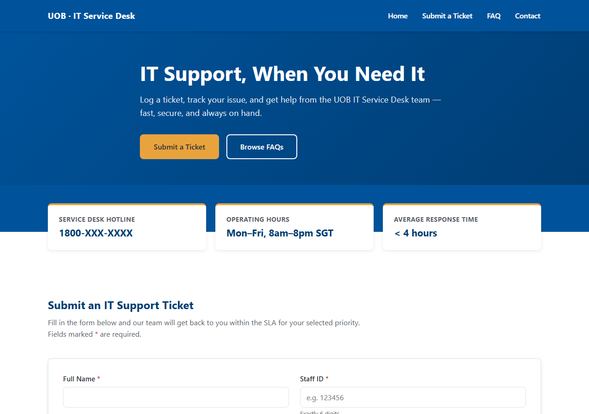

# UOB · IT Service Desk (Training Demo)

A single self-contained mockup of an internal IT Support Service Desk site, built as a Claude Code training exercise.

> **Training demo — not affiliated with or endorsed by United Overseas Bank Limited.**

## Live site

https://dannychoy84-pixel.github.io/claude-code-training-uob/



## Features

- Sticky navigation with a responsive hamburger menu on mobile
- Hero banner with quick-access buttons and three quick-info cards (hotline, hours, response time)
- An IT support ticket form with full client-side validation (required fields, Staff ID pattern, corporate email domain check, live character counters, and a warning if the description looks like it contains a password/OTP/credential)
- Mock ticket generation (`UOB-ITSD-YYYYMMDD-####`) with a priority-based SLA response, all handled in memory — no storage, no network calls
- A searchable FAQ accordion covering 8 common IT support questions

## Running it

No build step, no dependencies. Just open [`index.html`](index.html) directly in a browser.

## Project structure

```
index.html   — the entire site: markup, CSS, and JS in one file
CLAUDE.md    — guidance for Claude Code when working in this repo
```
